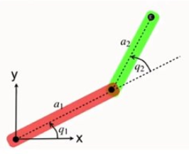

# Trabalho 04 - Cinemática Direta

- Universidade Federal de Uberlândia
- FEELT31722 Robótica
- Matheus Pelegrini Bucater
- 11921ECP022

Nesse trabalho foi desenvolvido um programa que recebe os parâmetros de Danavit-Hartenberg de um robô, assim como o mostrado abaixo, com dois elos e duas juntas e então retorna as coordenadas (x, y) de seu TCP.



## Pré-requisitos

- Python 3.8+
- pip

## Instalação

### 1. Clonando o diretório
```bash
git clone https://github.com/matheusbucater/rob-trab04.git
cd rob-trab04
```

### 2. Criação e ativação do ambiente virtual

#### Linux/macOS
```bash
python3 -m venv venv
source venv/bin/activate
```

#### Windows
```bash
python -m venv venv
.\venv\Scripts\activate
```

### 3. Instalação das dependências Python
```bash
pip install -r requirements.txt
```

## Rodando o programa

```bash
python main.py d1 theta1 a1 alpha1 d2 theta2 a2 alpha
```

Para obter ajuda, basta executar `python main.py help`.

```bash
uso: python main.py d1 theta1 a1 alpha1 d2 theta2 a2 alpha
 - d1          offset da junta 1
 - theta1      angulo da junta 1
 - a1          comprimento do elo 1
 - alpha1      torção do elo 1
 - d2          offset da junta 2
 - theta2      angulo da junta 2
 - a2          comprimento do elo 2
 - alpha2      torção do elo 2
```

### Exemplo

```bash
python main.py 0 90 5 0 0 -45 2 0
```


